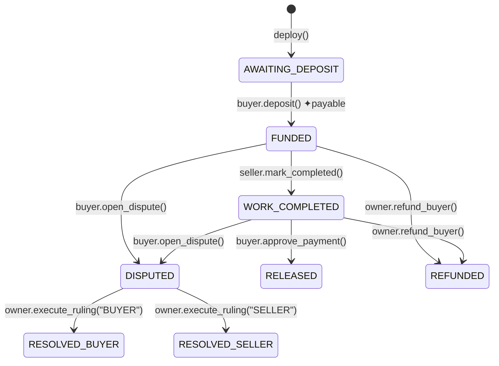

# SmartEscrow

Decentralized AI Dispute Resolution for Onchain Escrow

SmartEscrow is a GenLayer Intelligent Contract that enables buyer-seller escrow disputes to be resolved through decentralized AI judgment and settled according to the stored onchain ruling.

---

## 🌐 Deployment Information

- **Live Demo:** [https://genlayersmartescrow.vercel.app/](https://genlayersmartescrow.vercel.app/)
- **Network:** GenLayer Studio Next
- **Chain ID:** `61997`
- **Smart Contract Address:** `0x141A33cF38dEa2B3f0ae471B634c7962FAd18fBf`
- **Block Explorer:** [https://explorer-studio-dev.genlayer.com/address/0x141A33cF38dEa2B3f0ae471B634c7962FAd18fBf](https://explorer-studio-dev.genlayer.com/address/0x141A33cF38dEa2B3f0ae471B634c7962FAd18fBf)

---

## 💡 Why GenLayer?

Traditional escrow requires a centralized party to resolve disputes.

SmartEscrow uses GenLayer's decentralized judgment to evaluate dispute evidence and produce a consensus ruling.

The ruling is stored by the intelligent contract and settlement is executed according to that validated outcome.

GenLayer is therefore part of the core dispute-resolution mechanism, not simply an external AI service.

---

## 📂 Project Structure

```
.
├── contracts/
│   ├── SmartEscrow.py           # GenLayer Intelligent Contract (Python)
│   └── tests/
│       └── test_smart_escrow.py # Comprehensive Pytest suite (direct-VM mode)
├── src/
│   ├── app/
│   │   ├── globals.css          # Styling & Glassmorphic Design tokens
│   │   ├── layout.tsx           # Global Next.js app layout
│   │   └── page.tsx             # Interactive Landing Page
│   ├── components/
│   │   ├── Architecture.tsx     # Step-by-step Intelligent Pipeline explorer
│   │   ├── Demo.tsx             # Production DApp interface connected to GenLayer Studio Next
│   │   ├── Features.tsx         # Technical value proposition highlights
│   │   ├── Hero.tsx             # Primary landing interface
│   │   ├── HowItWorks.tsx       # Flow progression overview
│   │   ├── Navbar.tsx           # Navigation header
│   │   └── Team.tsx             # Developer details
│   └── lib/
│       └── smartEscrowClient.ts # GenLayer RPC & Wallet integration client
├── package.json                 # Next.js workspace config & scripts
└── README.md                    # Project documentation
```

---

## 🤝 SmartEscrow Intelligent Contract

The core smart contract logic is implemented in [SmartEscrow.py](file:///contracts/SmartEscrow.py). It holds funds securely between a Buyer and a Seller, arbitrating disputes autonomously through validator-executed Large Language Models (LLMs).

### ⚙️ State Machine Lifecycle



### 🧠 LLM Equivalence Principle Integration

When a dispute arises, any party can call `resolve_dispute_with_ai()`. This invokes GenLayer's consensus-based LLM engine:

```python
ruling_json = gl.eq_principle.prompt_non_comparative(
    build_prompt,
    task="Analyse dispute evidence and return JSON with 'ruling' (BUYER or SELLER) and 'reasoning'.",
    criteria="""
        The response is a valid JSON object.
        The 'ruling' field is exactly 'BUYER' or 'SELLER'.
        The decision is logically consistent with the evidence.
    """
)
```

By leveraging `gl.eq_principle.prompt_non_comparative`, multiple validator nodes query distinct LLMs and check the output against semantic criteria. If consensus is reached, the ruling is stored onchain for settlement execution.

---

## 🖥️ Next.js DApp Frontend

The frontend features a production-style Web3 interface connected directly to the deployed SmartEscrow Intelligent Contract on GenLayer Studio Next.

### Primary DApp Flow
1. **Deposit**: Buyer deposits funds into the escrow contract.
2. **Mark Completed**: Seller submits proof of work completion.
3. **Open Dispute**: Either party opens a dispute if deliverables differ from terms.
4. **Submit Evidence**: Buyer and Seller submit detailed evidence.
5. **Resolve with GenLayer**: Triggers multi-LLM consensus resolution onchain.
6. **Execute Ruling**: Automatically settles funds to the winning party based on the stored ruling.

---

## 🚀 Quick Start & Local Setup

### 1. Run the Intelligent Contract Pytest Suite

Ensure Pytest and the GenLayer Python Test SDK are installed locally:

```bash
# Install test libraries
pip install genlayer-test pytest

# Execute tests in direct VM mode
pytest contracts/tests/test_smart_escrow.py -v
```

### 2. Start the Next.js Frontend App

To interact with the frontend components locally:

```bash
# Install packages
npm install

# Run the development server
npm run dev
```

Open [http://localhost:3000](http://localhost:3000) to view the live dashboard console.

---

## 🔒 Contract Security Mechanics

1. **Re-entrancy Guard**: Safe state progression is guaranteed by updating on-chain variables before triggering value transfers using `emit_transfer()`.
2. **Deterministic State Isolation**: State variables are copied to local variables before non-deterministic `eq_principle` blocks execute, keeping validator sandboxes clean.
3. **Role Access Control**: State modifications enforce modifiers that restrict actions strictly to relevant actors (`_only_buyer`, `_only_seller`, `_only_owner`).
