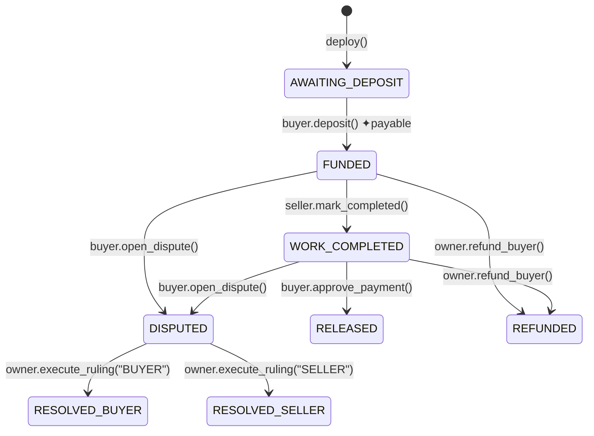

# GenLayer Intelligent

An advanced application built on the **GenLayer** platform. This project features a secure, AI-arbitrated **SmartEscrow** Intelligent Contract (Python) alongside a high-fidelity **Next.js DApp Frontend Showcase** simulating multi-LLM validator consensus in real-time.

---

## 📂 Project Structure

```
d:\GenLayerIntelligent\
├── contracts/
│   ├── SmartEscrow.py           # GenLayer Intelligent Contract (Python)
│   └── tests/
│       └── test_smart_escrow.py # Comprehensive Pytest suite (direct-VM mode)
├── src/
│   ├── app/
│   │   ├── globals.css          # Styling & Glassmorphic Design tokens
│   │   ├── layout.tsx           # Global Next.js app layout
│   │   └── page.tsx             # Interactive Landing Page
│   └── components/
│       ├── Architecture.tsx     # Step-by-step Intelligent Pipeline explorer
│       ├── Demo.tsx             # Live DApp Console simulator with MetaMask hook
│       ├── Features.tsx         # Technical value proposition highlights
│       ├── Hero.tsx             # Premium above-the-fold interface
│       ├── HowItWorks.tsx       # Flow progression overview
│       ├── Navbar.tsx           # Dynamic glass header navigation
│       ├── Team.tsx             # Project contributors & roles
│       └── ...
├── package.json                 # Next.js workspace config & scripts
└── README.md                    # Project documentation (this file)
```

---

## 🤝 SmartEscrow Intelligent Contract

**Deployed Smart Contract Address (GenLayer Studio Testnet):**  
`0xb4412590158f0CceEc98ebffAFf99C851Ab6703c`

The core smart contract logic is implemented in [SmartEscrow.py](file:///d:/GenLayerIntelligent/contracts/SmartEscrow.py). It holds funds securely between a Buyer and a Seller, arbitrating disputes autonomously through validator-executed Large Language Models (LLMs).

### ⚙️ State Machine Lifecycle



### 🧠 LLM Equivalence Principle Integration

When a dispute arises, any party can call `resolve_dispute_with_ai()`. This invokes GenLayer's consensus-based LLM engine:

```python
ruling_json = gl.eq_principle.prompt_non_comparative(
    build_prompt,
    task="Analyse dispute evidence and return JSON with 'ruling' (BUYER or SELLER) and 'reasoning'.",
    criteria="""
        The response is a valid JSON object.
        The 'ruling' field is exactly 'BUYER' or 'SELLER'.
        The decision is logically consistent with the evidence.
    """
)
```

By leveraging `gl.eq_principle.prompt_non_comparative`, multiple validator nodes query distinct LLMs (e.g., Claude, GPT, Llama) and check the output against semantic criteria. If consensus is reached, the transaction is finalized.

---

## 🖥️ Next.js DApp Frontend Showcase

The frontend features a premium, responsive Web3 interface showcasing how GenLayer decentralized applications operate under the hood.

### Key Interactive Components
- **Live DApp Simulator (`Demo.tsx`)**: 
  - Allows connection to Web3 wallets (e.g., MetaMask).
  - Automatically prompts adding/switching to **GenLayer Studio Testnet** (Chain ID: `61999`, Currency: `GEN`, RPC: `studio.genlayer.com/api`).
  - Simulates transaction requests (e.g., Flight Delay Insurance, Crypto Price Verification, Lease Audit) and visualizes multi-LLM consensus verification logs step-by-step.
- **Intelligent Pipeline Explorer (`Architecture.tsx`)**:
  - Interactive diagram following requests from User ➔ Frontend ➔ API Gateway ➔ GenLayer VM ➔ AI Consensus ➔ Blockchain Finalization.
  - Live code inspector updating mock JSON requests and Python VM outputs dynamically.

---

## 🚀 Quick Start & Installation

### 1. Setup Local GenLayer Node

Ensure Node.js and Docker are running on your system.

```bash
# Install the GenLayer CLI globally
npm install -g @genlayer/cli

# Spin up local development environment
genlayer init
genlayer up
```

### 2. Run the Intelligent Contract Pytest Suite

Ensure Pytest and the GenLayer Python Test SDK are installed locally:

```bash
# Install test libraries
pip install genlayer-test pytest

# Execute tests in direct VM mode
pytest contracts/tests/test_smart_escrow.py -v
```

### 3. Start the Next.js Frontend App

To interact with the frontend components locally:

```bash
# Navigate to workspace and install packages
npm install

# Run the development server
npm run dev
```

Open [http://localhost:3000](http://localhost:3000) to view the live dashboard console.

---

## 🔒 Contract Security Mechanics

1. **Re-entrancy Guard**: Safe state progression is guaranteed by updating on-chain variables (`self.amount = 0`, `self.state = STATE_RELEASED`) **before** triggering value transfers using `emit_transfer()`.
2. **Deterministic State isolation**: State variables (`self.*`) are copied to local variables before non-deterministic `eq_principle` blocks execute, keeping validator memory sandboxes clean.
3. **Role Access Control**: State modifications enforce modifiers that restrict actions strictly to relevant actors (e.g., `_only_buyer`, `_only_seller`, `_only_owner`).
